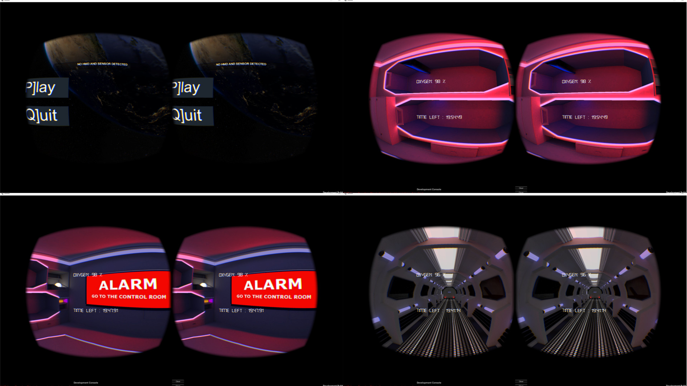

# VRSpace: a virtual experience in a Space Ship

VRSpace is an [Oculus-Rift](https://www.oculus.com/rift) game set in a space ship.

It has been developed in C# with [Unity](https://unity3d.com/).

## Authors
This project is the result of summer internship during the first year at the [University of Cagliari](https://www.unica.it/). The game has been developed in 2014 by:

* Mattia Atzeni
* Nicola Frongia
* Nicola Garau

